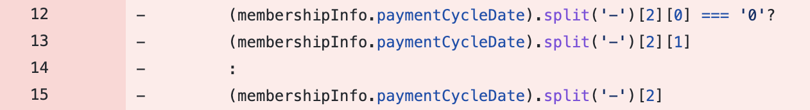
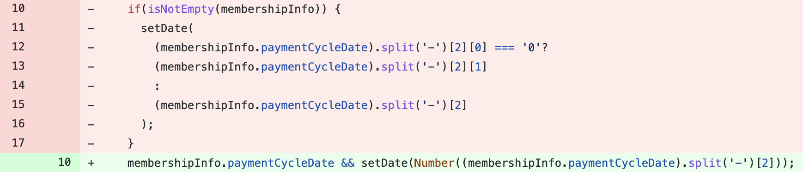

# 형변환으로 똑똑하게 날짜 데이터 처리하기
---
  
[모두(MODU)](https://www.notion.so/d92d6723c9ae4e3b93a41b886036cfae) 결제기능 업데이트를 위해 리액트 개발을 진행 중이다.  
아래와 같은 컴포넌트를 만들기 위해 개발 중, 날짜 데이터를 받아 원하는 형태로 처리하여 사용해야했다. 
  
<br>

- membershipInfo.paymemtCycleDate는 받아온 날짜 데이터이다. 해당 날짜 데이터에서 Month와 Date만 잘라내어 사용하고 싶었다.   
  
<br>

## 초기 아이디어
- 문자열 슬라이싱을 활용한다. 
- "YYYY-MM-DD"이라는 String을 "-"을 기준으로 split하자.  
- Month와 Day가 한 자리 수일 경우를 찾아 0을 제거해주자.  
<br>

## Problem 
- 첫 자리가 0인지 확인 후 0을 제거해주는 과정에서 삼항연산자를 활용했음에도 불구하고, 코드가 너무 길고 지저분하다. 최적화할 수 있는 방법이 없을까?
  
<br>

## Solution
- String-to-Int 형변환을 똑똑하게 활용하자! 
- String인 날짜 데이터를 Int로 형변환하면, 자동으로 첫 자리의 0은 날라간다! 
  - ex) "04" : String => 4 : Int
- String-to-Int 형변환을 위해 parseInt가 아닌 ```Number``` 라는 Wrapper Object를 활용하자! 
  - parseInt()는 문자열에 숫자가 아닌 값이 포함된 경우, 숫자가 끝날때 까지만 형변환을 진행한다. parseInt("1000원")을 진행하면 1000이 return된다.
  - 반면, Number()는 문자열에 숫자가 아닌 값이 포함된 경우 NaN(Not a Number)을 return한다. 

길고 복잡했던 코드를 깔끔한 한 줄로 정리할 수 있었다😄
  
<br>
<br>

### 참고자료
---
[형변환 Number() 와 parseInt() 의 차이](https://dororongju.tistory.com/71)


