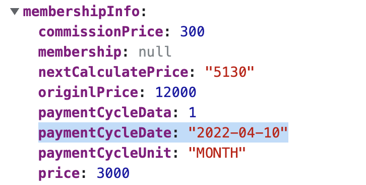

# 형변환으로 똑똑하게 날짜 데이터 처리하기
---
  
[모두(MODU)](https://www.notion.so/d92d6723c9ae4e3b93a41b886036cfae) 결제기능 업데이트를 위해 리액트 개발을 진행 중이다.  
아래와 같은 컴포넌트를 만들기 위해 개발 중, 날짜 데이터를 받아 원하는 형태로 처리하여 사용해야했다. 
  
 

membershipInfo.paymemtCycleDate는 받아온 날짜 데이터이다. 해당 날짜 데이터에서 Month와 Date만 잘라내어 사용하고 싶었다.   
  
 

### 초기 아이디어
---
"YYYY-MM-DD"이라는 String을 "-"을 기준으로 split하자.  
Month와 Day가 한 자리 수일 경우를 찾아 0을 제거해주자.  
 

### Problem 
--- 

 

### 참고자료
